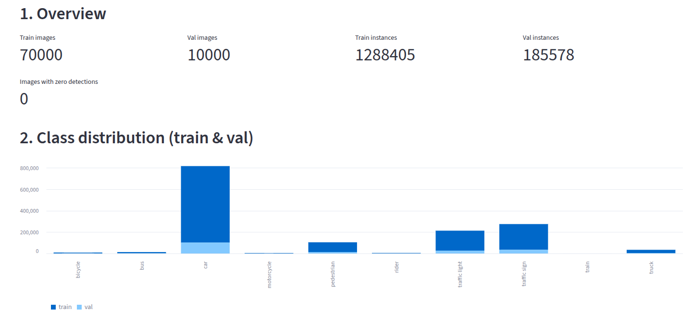
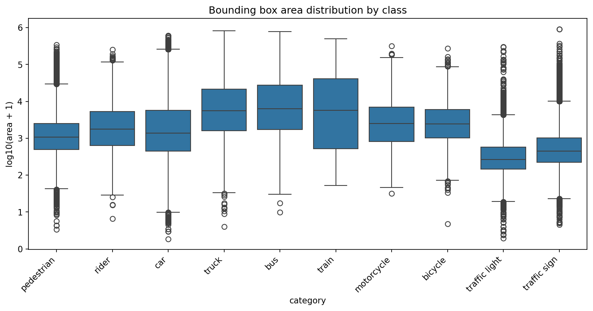
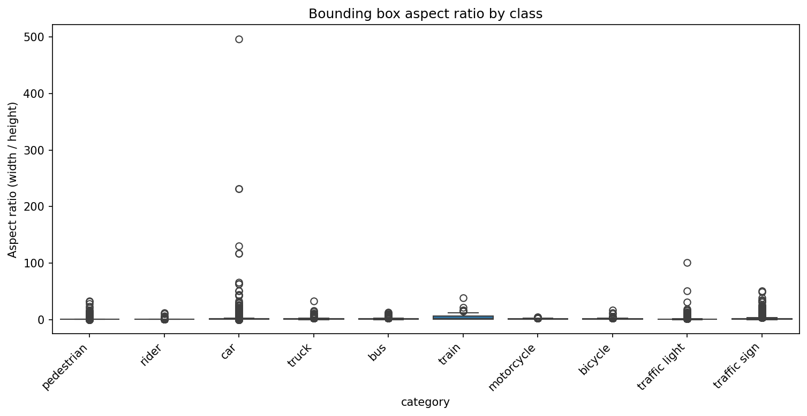
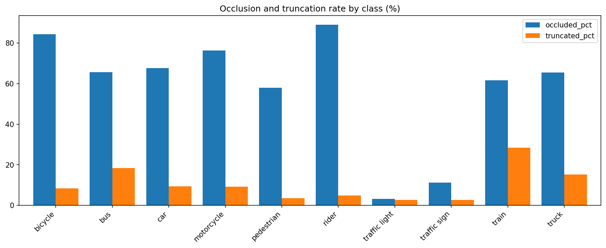
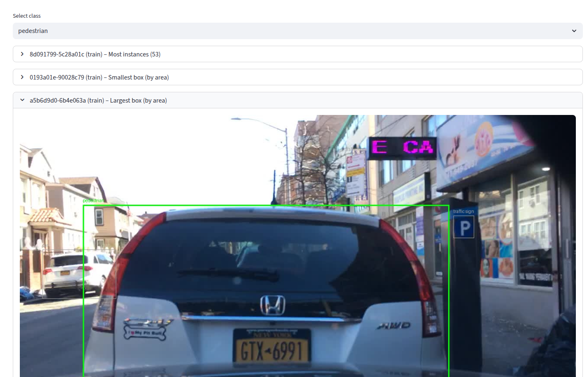

# BDD100K Object Detection – Data Analysis Report

This document describes the data analysis performed on the Berkeley DeepDrive (BDD100K) dataset for the **object detection** task. Only the 10 detection classes with bounding box annotations are considered; drivable area, lane marking, and other semantic segmentation data are excluded.

### Key insights for training

- Mitigate severe class imbalance by using class-aware sampling or loss reweighting (e.g., focal loss / inverse-frequency weights) so rare classes like bicycle, rider, motorcycle, train meaningfully contribute during training instead of being drowned out by car and traffic sign.
- Bias training toward small-object detection by increasing input resolution and enabling multi-scale/feature-pyramid emphasis (plus stronger small-object augmentations), since several high-impact classes (traffic light, traffic sign, pedestrian) have very small median areas and will otherwise be underfit.
- Adopt anchor-free or aspect-ratio–adaptive training (or greatly expand anchor ratios) to handle the extreme width/height variance—especially for train, car, and traffic light—so rare elongated shapes aren’t systematically mismatched during box regression.
- Prioritize heavy occlusion robustness: Since most object classes (especially rider, bicycle, motorcycle, car, bus, truck) show very high occlusion rates (≈60–90%), add strong occlusion-focused augmentations (CutOut/Hide-and-Seek, copy-paste occluders, random erasing) and increase sampling weight for heavily occluded instances to improve recall under partial visibility.
- Some annotations contain label errors (for example, an oversized pedestrian box that actually covers a car). Auditing and correcting these mislabeled instances will reduce label noise and improve model performance and stability.

---

## 1. Dataset and Scope

### 1.1 Data Source and Structure

- **Dataset**: [BDD100K](https://www.bdd100k.com/) (Berkeley DeepDrive).
- **Downloaded components**: 100K Images (~5.3GB) and detection Labels (~107 MB).
- **Splits analyzed**: **train** and **val** only (test set is not required for this analysis).

Expected directory layout:

```
BDD/
├── images/
│   ├── train/   # *.jpg (one per label file)
│   └── val/     # *.jpg
└── labels/
    ├── train/   # *.json (Scalabel format, one per image)
    └── val/     # *.json
```

Each label JSON contains a `name` (image base name), `frames` (typically one frame per image), and per-frame `objects`. Objects may have:

- **Detection**: `box2d` with `x1, y1, x2, y2` and `category` (e.g. `car`, `person`, `traffic light`).
- **Non-detection**: `poly2d` or categories under `area/` or `lane/` (drivable area, lane markings). These are **ignored** in this analysis.

### 1.2 Detection Classes

The 10 object detection classes (canonical names used in this repo) are:

| Index | Class         | Notes (raw label names in JSON)     |
|-------|---------------|-------------------------------------|
| 0     | pedestrian    | Mapped from `person`                |
| 1     | rider         | —                                  |
| 2     | car           | —                                  |
| 3     | truck         | —                                  |
| 4     | bus           | —                                  |
| 5     | train         | —                                  |
| 6     | motorcycle    | Mapped from `motor`                |
| 7     | bicycle       | Mapped from `bike`                 |
| 8     | traffic light | —                                  |
| 9     | traffic sign  | —                                  |

Category aliases (e.g. `person` → `pedestrian`, `bike` → `bicycle`, `motor` → `motorcycle`) are applied in the parser so all detection objects are counted under these 10 classes.

## 2. Data Analysis

### 2.1 Class Distribution

  

### 2.2 Box Area by class

 

### 2.3 Aspect Ratio by class

 

### 2.4 Occlusion and Truncation

 

### 2.5 Interesting samples

 
*Incorrect annotation of a car as pedestrian*

 
*Largest cycle label is a rickshaw*