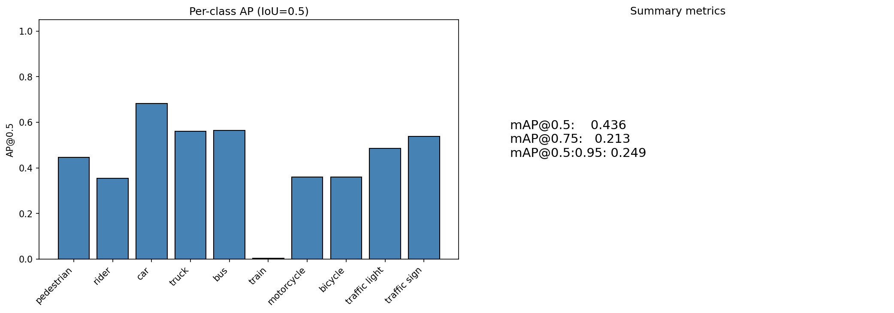
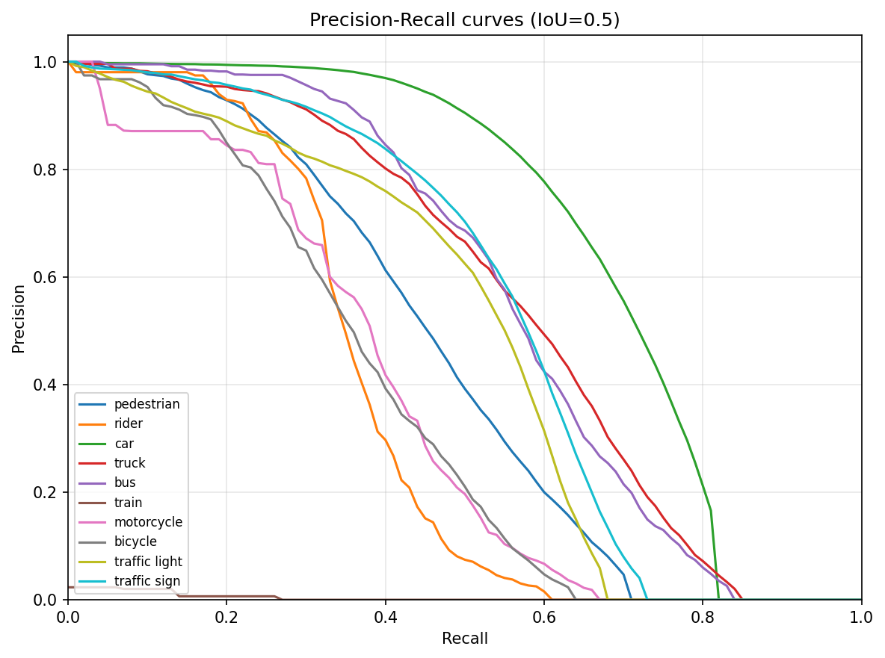
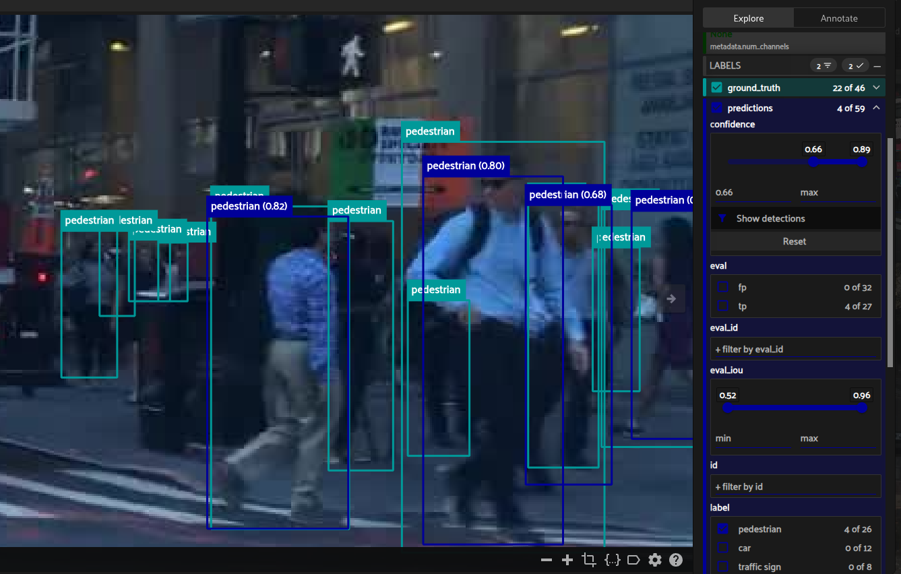
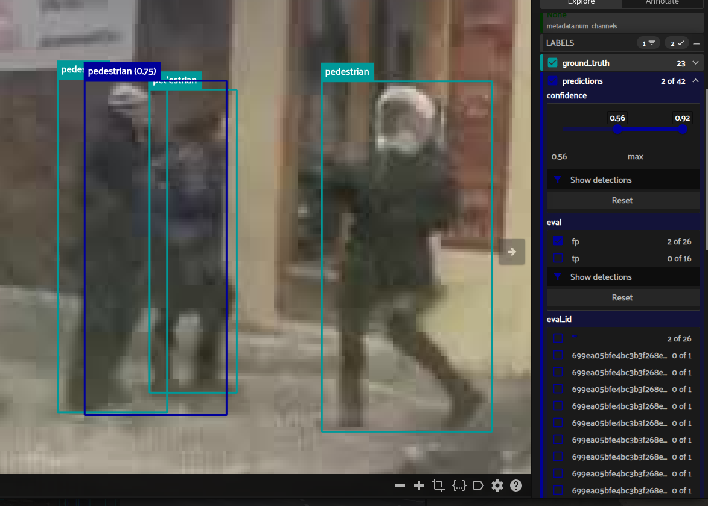
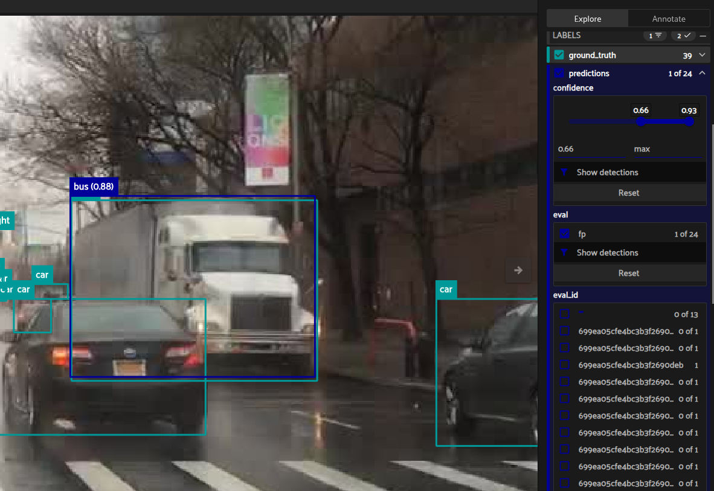

# Evaluation and Visualization

This document describes how the detection model is evaluated on the BDD validation set, which metrics are used and why, how quantitative and qualitative results are visualized, and how failure analysis is used to suggest improvements.

---

## 1. Metrics and Why They Were Chosen

### 1.1 Primary metrics

We report **COCO-style** detection metrics on the **validation** split:

| Metric | Description | Why chosen |
|--------|-------------|------------|
| **mAP@0.5** | Mean Average Precision at IoU threshold 0.5 | Standard for object detection; single threshold, easy to interpret and compare. BDD and many benchmarks use it. |
| **mAP@0.75** | Mean AP at IoU = 0.75 | Stricter localization; highlights models that predict tight boxes. |
| **mAP@0.5:0.95** | Mean of AP at IoU 0.5, 0.55, …, 0.95 | COCO primary metric; balances detection recall and localization quality. |
| **Per-class AP@0.5** | AP@0.5 for each of the 10 BDD classes | Shows which classes the model handles well or poorly; guides data or model improvements. |

## 2. Quantitative Visualization

  
*mAP plot*

  
*PR Curve*

### 2.1 Inference timing (single-image)

| Stat  | Value   |
|-------|---------|
| mean  | 11.68 ms |
| median| 11.63 ms |
| p95   | 12.61 ms |
| FPS   | 85.6    |

Inference time is reported using NVIDIA 4090 GPU averaged over 200 forward passes of a single image.

## 3. Qualitative Visualization and Failure Clustering

### 3.1 Failure analysis (FiftyOne)
 
Failure analysis is run with FiftyOne. The App loads BDD valid + model predictions, runs evaluation, and lets you inspect false positives and false negatives.

  
*Pedestrian FN on occluded pedestrians*

  
*Combined prediction box on two overlapping pedestrians*

  
*Misclassification of a truck as bus*

---

### 4. Connecting evaluation to data analysis

- **Low mAP on rare classes** — Per-class AP@0.5 is low for bicycle, rider, motorcycle, train; this aligns with the severe class imbalance in the data (see [DATA_ANALYSIS](DATA_ANALYSIS.md)) where car and traffic sign dominate. Class-aware sampling or loss reweighting (e.g. focal loss) can help.
- **False negatives on occluded objects** — Many FNs occur on partially visible instances (e.g. occluded pedestrians). The data analysis shows very high occlusion rates (~60–90%) for rider, bicycle, motorcycle, car, bus, truck; the model underfits these if training does not emphasise occlusion.
- **Label noise** — Some evaluation errors (e.g. obvious FP/FN) stem from annotation issues (oversized or wrong-class boxes); the data analysis notes such label noise; cleaning or re-auditing those instances can improve both metrics and training stability.

## 5. Suggested Improvements (Model and Data)

- **Data augmentation for underrepresented classes** — Oversample or apply stronger augmentation (e.g. mixup, copy-paste) on rare classes so the model sees them more often without biasing the overall distribution too much.
- **Augmentations for occluded objects** — Use occlusion-style augmentations (e.g. random crop, cutout, or paste of occluders) so the model sees more partially visible objects and learns to handle them better.
- **Sampling** — Use class-balanced sampling (e.g. repeat or weight images that contain low-AP classes) so training batches are less dominated by frequent classes.
- **Focal loss** — Down-weight easy examples and focus the loss on hard ones; helps when there is class imbalance and many easy backgrounds.
- **Learning rate scheduler** — Use a schedule (e.g. cosine decay, step decay) so the learning rate drops over training and helps convergence and final mAP.
- **Model variants** — Try larger variants (e.g. small or medium) if latency allows; trade off throughput for higher mAP and re-measure to stay within budget.
- **Regularization** — If the training loss curve shows overfitting (train loss keeps dropping while val mAP flattens or drops), increase regularization (e.g. dropout, weight decay, or stronger augmentation).

---
